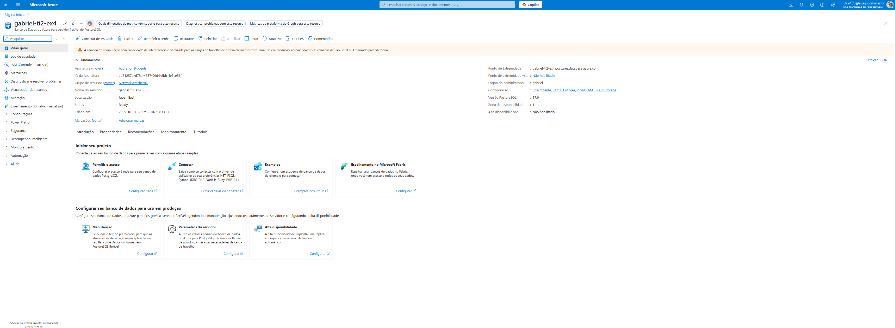

# EXERCÍCIO 4 - TI2: Consumo de IA como Serviço (Azure Cognitive Services) - Gabriel Egídio Santos Beloni

Este projeto demonstra a implementação da **Opção (b)** da atividade acadêmica, consumindo um serviço cognitivo pronto do Microsoft Azure (IA como Serviço) através de uma aplicação Java.

O serviço de IA escolhido foi o **Reconhecimento de Entidades (Named Entity Recognition - NER)**, parte do "Serviço de Linguagem" do Azure.

---

## O que a IA do Projeto Faz?

O modelo de IA utilizado neste projeto é um serviço que lê e analisa um texto não estruturado para identificar e extrair informações específicas.

O objetivo dele é **encontrar e classificar "entidades"** dentro do texto, transformando dados brutos em informações estruturadas. As categorias que ele reconhece incluem:

* **Pessoas:** (ex: "João Silva")
* **Organizações:** (ex: "Microsoft", "Dell")
* **Locais:** (ex: "São Paulo")
* **Produtos:** (ex: "notebook")
* **Datas, Horários, Quantidades,** e mais.

Em resumo, a IA "lê" uma frase comum e "etiqueta" as partes importantes, informando o que cada parte é e qual seu nível de confiança nessa classificação.

## O que o Código Java Faz?

O código Java (`AI.java`) é a aplicação "consumidora" que se conecta e utiliza o modelo de IA que está hospedado na nuvem do Azure.

O processo de execução do código é o seguinte:

1.  **Autenticação:** O código primeiro se autentica no Azure usando a **Chave de API** e o **Ponto de Extremidade (Endpoint)** fornecidos pelo recurso de IA criado.
2.  **Preparação:** Um texto de exemplo é definido dentro de uma variável `String`.
3.  **Chamada de API:** O código envia esse texto para o modelo de IA na nuvem, chamando o método `client.recognizeEntities()`.
4.  **Processamento da Resposta:** A IA no Azure analisa o texto e retorna uma lista de entidades que ela encontrou.
5.  **Exibição:** O código Java itera essa lista e imprime no console cada entidade encontrada, sua categoria (Pessoa, Local, Organização, etc.) e a pontuação de confiança da IA.

### Exemplo de Saída do Console:

```text
Analisando o texto: "O meu amigo João Silva vai se mudar para São Paulo para trabalhar na Microsoft. Ele comprou um notebook Dell novo para o trabalho."

--- ENTIDADES RECONHECIDAS ---
Entidade encontrada: 'João Silva'
	Categoria: Person
	Subcategoria: null
	Pontuação: 0.99

Entidade encontrada: 'São Paulo'
	Categoria: Location
	Subcategoria: GPE
	Pontuação: 1.00

Entidade encontrada: 'Microsoft'
	Categoria: Organization
	Subcategoria: null
	Pontuação: 1.00

Entidade encontrada: 'Dell'
	Categoria: Organization
	Subcategoria: null
	Pontuação: 0.95

```

---

## Recursos Criados no Azure

Abaixo estão os screenshots dos recursos configurados no portal do Microsoft Azure para a realização desta e de outras atividades.

### 1. Visão Geral do Banco no Azure



**Descrição:** Visão geral do Grupo de Recursos (`Resource Group`) no Azure, mostrando os diferentes serviços criados para a disciplina.

### 2. Dentro do SQL


**Descrição:** Detalhes do servidor de banco de dados criado no Azure. Este recurso foi utilizado para testes de conexão com clientes de banco de dados como o DBeaver.

### 3. Máquina Virtual


**Descrição:** Este é o recurso principal da **Opção (b)**. É o painel do "Serviço de Linguagem" (IA). É desta tel, que o código Java (`AI.java`) utiliza para consumir o modelo de Reconhecimento de Entidades.

